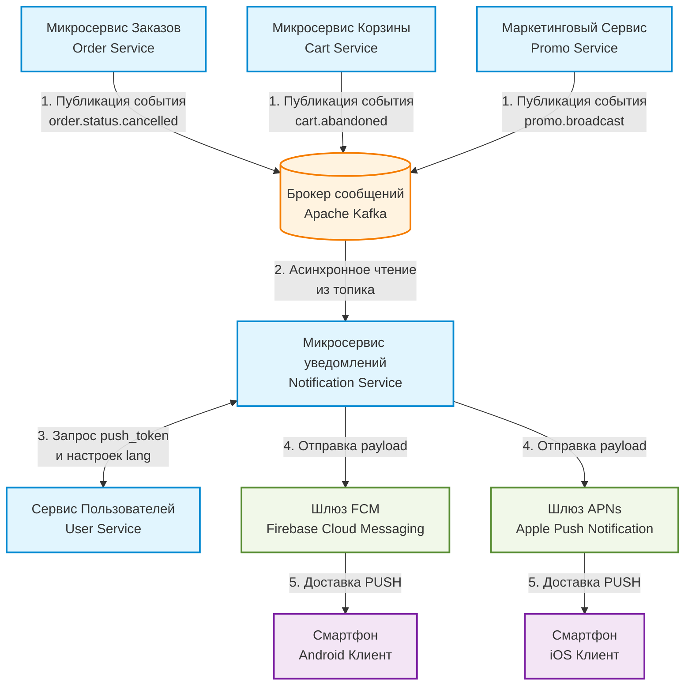
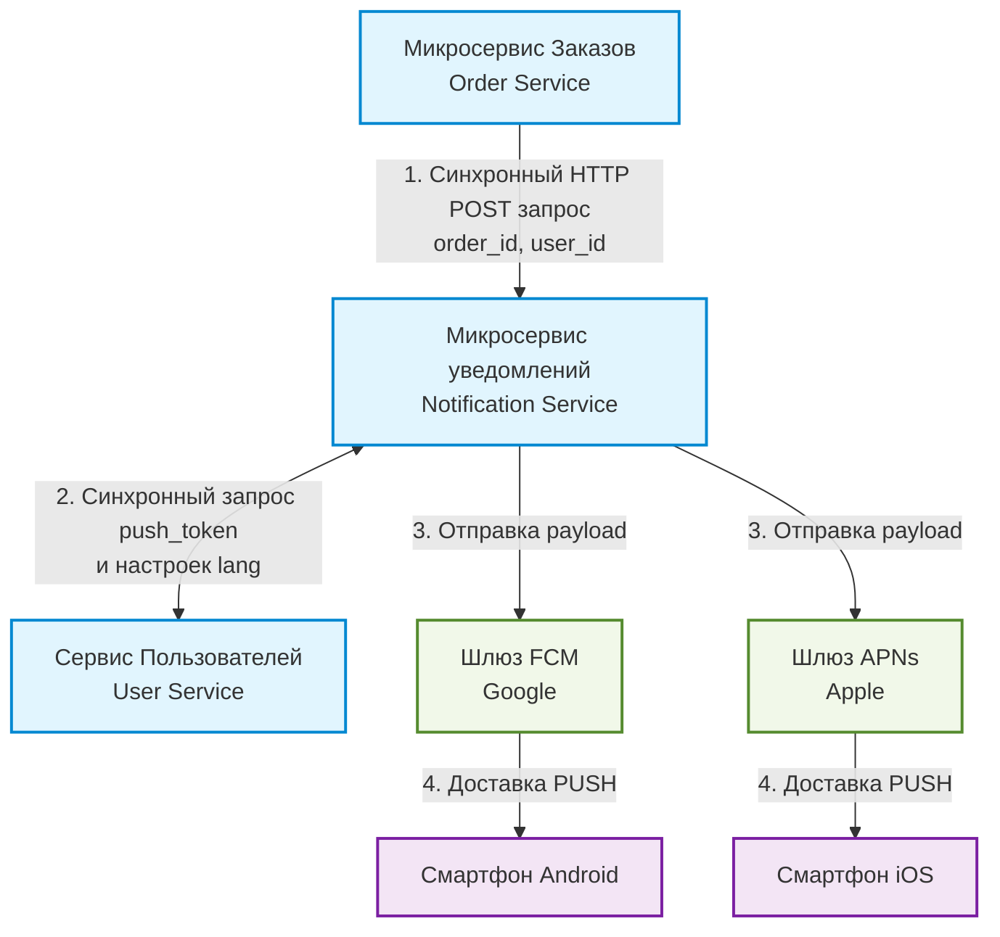
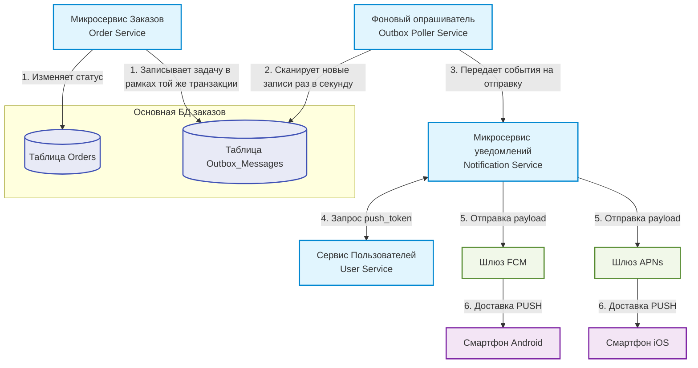
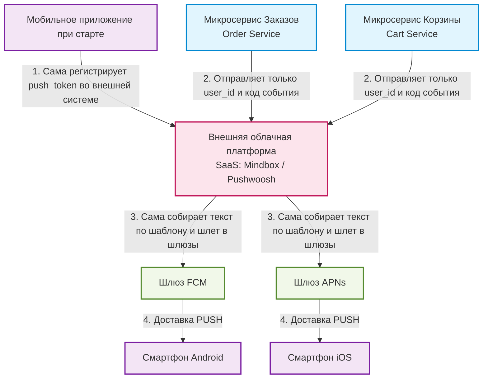

# задание 1
## логические противоречия и недочёты
1. в п.2 первая половина требования дублирует требование из п.1, там прямо указан диапазон - от 1 до 10.
2. п.2 напрямую противоречит п.9. Не стабилизировано требование в части всех возможных вариантов удаления товара из корзины.
3. п.7 напрямую противоречит п.13. Не стабилизировано требование в части цены товара в корзине, для случая когда цена товара меняется.
4. п.1, п.3 и п.4. логические противоречия. с учётом ограничений п.1 и п.3 суммарное количество всех товаров в корзине не может превышать 50, что противоречит ограничению п.4 (20  штук)
5. п.5 - бесполезное требование, не несущее смысловой нагрузки.
6. п.6, избыточное требование к пользовательскому интерфейсу - когда пользователь добавляет последний товар в корзину(достигая лимита) - система уже знает что больше добавлять нельзя(лимит проверяется при добавлении, и при загрузке экранной формы корзины при повторном входе в корзину), в таком случае в интерфейсе должен быть маркер что добавлено максимальное количество данного товара без возможности добавить ещё.
7. ограничение в п.5 содержится в требовании п.3
8. п.8, не указана общая стоимость корзины, для информирования клиента перед оплатой и выставления счёта. клиент должнен это сам считать?
9. п.10 - формулировка "может быть реклама" это не строгое условие, означающее что её "может и не быть", что автоматически означает что должны быть определены чёткие условия при которых реклама показывается.
10. п.11, нет критериев что считать "будним днём", "утром" и "вечером". не ясно зачем эти вообще нужны эти временные требования и какую бизнес проблему/задачу они решают (чем обусловлен тот факт что пользователю "днём" реклама не показывается?). пользователь либо видит рекламу на экране корзины, либо нет, независимо от того зашёл он в "обед", "днём", "утром", "вечером", "в полночь", "в будний день"(а если он на вахте/ненормированном графике?), "в выходной", "на праздник" - это всё временные рамки покупателя а не товара/корзины/рекламного предложения. абсолютно рудиментароное требование, которое может иметь эффект упущенной прибыли для продавца.

## уточняющие вопросы продукт-менеджеру или бизнес-заказчику.
**это разве работа системного аналитика? это уже full-stack**

*Часть указанных вопросов могут быть не заданы, либо заданы другие уточняющие вопросы (на лету). Всё зависит от ответов заказчика. В т.ч. конечный вариант стабилизированных и согласованных требований, который возможен ислючительно после работы с заказчиком, выяснения всех ньюансов и поиска возможных компромиссов*

1. количественные ограничения, пп.1,2,3,4,6
 - чем обусловлены жёсткие числовые ограничения на количество товара, какую бизнес-ценность они несут и чем продиктованы?
 - почему нигде не описаны требования к этим числовым ограничениям в части доступности товара на складе и его количества?
 - можно ли менять эти числовые ограничения в административном интерфейсе, или эти цифры - навсегда?
 - п.1, о каком источнике добавления товара идёт речь, о странице в магазине или о самой корзине? что будет если клиент 10 раз добавил товар в корзину со страницы в магазине по 10 позиций за раз? как в этом случае должно работать ограничение из п.4?
 - чем обусловлено требование в п.4? если клиент хочет купить 19 стаканов и 1 бугатти, почему он не может купить вторую бугатти пока не удалит 1 стакан? какую бизнес-ценность имеет требование по влиянию разных товарных позиций на общий лимит?
 - п.6 - избыточное требование к пользовательскому интерфейсу - когда пользователь добавляет последний товар в корзину(достигая лимита) - система уже знает что больше добавлять нельзя(лимит проверяется при добавлении, и при загрузке экранной формы корзины при повторном входе в корзину), в таком случае в интерфейсе будет маркер что добавлено максимальное количество данного товара без возможности добавить ещё.
2. какую смысловую нагрузку и бизнес-ценность несёт п.5 требований?
3. изменение цены товара в корзине, п.7, 13
 - так какая цена в корзине, динамическая или статическая?
 - что будет если цена товара изменилась когда клиент уже на странице оплаты? предлагаю ввести термин "жизненный цикл корзины заказов", и учитывать что клиент уже нажал кнопку "оплатить" при смене цены у товарной позиции. цена не меняется пока статус у корзины - в процессе оплаты и меняется для всех остальных статусов (создана, ошибка оплаты).  дополнительно уведомлять клиентов что цена у товарной позиции изменилась. в остальных случаях цена всех товарных позиций актуализируется при входе на экранную форму и на странице оформления заказа.
 4. п.8 - указана только стоимость товарных позиций и нет общей стоимости корзины, для информирования клиента перед оплатой и выставления счёта.
 5. удаление товара из корзины, п.9, п.2
 - предлагаю сделать удаление товара из корзины либо при нажатии на кнопку "-" когда в корзине один товар, либо на значёк корзины с товарной позицией. 
 - предусмотреть отдельную кнопку для очистки всей корзины.
 - перед удалением товарной позиции или очистки корзины запрашивать у пользователя подтверждение.
 6. реклама. п.10, п.11
 - чем обусловлены требования в п.10 и п.11 и какую бизнес-ценность они несут?
 - предлагаю показывать рекламу всегда, при входе клиента в козину. разделить на 3 рекламных блока: "сопутствующие товары", "с этим часто покупают", "рекламные акции, скидки и предложения"

 # задание 2

 ## [OpenAPI специцикация](https://pavel-belous.github.io/swagger-github-pages)

там же пример запроса и ответа согласно скриншоту.

# задание 3

## вариант №1 - Асинхронный Pub-Sub (Kafka/RabbitMQ) - Предпочтительный

## вариант №2 - Синхронный REST API (HTTP/gRPC)

## Вариант №3 - через базу данных (Transactional Outbox)

## Вариант №4 - Готовая SaaS-платформа (Mindbox и др.)

## Сравнительный анализ архитектурных решений отправки PUSH-уведомлений

| Критерий | Основной вариант: Асинхронный Pub-Sub (Kafka/RabbitMQ) | Синхронный REST API (HTTP/gRPC) | Transactional Outbox | Готовая SaaS-платформа (Mindbox и др.) |
|---|---|---|---|---|
| Связность компонентов | Минимальная (Сервисы полностью изолированы друг от друга через шину) | Высокая (Сервис заказов жестко зависит от сервиса пушей) | Низкая (Связующим звеном выступают таблицы в базе данных) | Низкая (Все сервисы зависят только от внешнего API платформы) |
| Отказоустойчивость | Высокая (При падении сервиса пушей сообщения копятся в очереди шины) | Низкая (Если сервис пушей упал — уведомление потеряно навсегда) | Очень высокая (Данные заказа и пуша сохраняются в одной транзакции) | Высокая (Зависит от надежности серверов внешнего провайдера) |
| Влияние на бизнес-логику | Отсутствует (Сервис заказов просто сбрасывает событие в шину и работает дальше) | Критическое (Медленный ответ от Google/Apple тормозит процесс покупки) | Минимальное (Запись в БД происходит мгновенно, отправка идет в фоне) | Минимальное (Бизнес-сервисы шлют легкий вебхук во внешнюю систему) |
| Сложность внедрения и поддержки | Высокая (Требуется развертывание, администрирование и мониторинг кластера Kafka) | Минимальная (Пишется за несколько дней, не требует стороннего софта) | Средняя (Нужно проектировать таблицы и писать фоновые демоны-опрашиватели) | Низкая для бэкенда (Интеграция по API, но сложная настройка SDK в приложении) |
| Масштабируемость под массовые рассылки | Отличная (Kafka спроектирована под обработку миллионов сообщений в секунду) | Плохая (При рассылке на 1 млн пользователей серверы бэкенда «лягут» от нагрузки) | Плохая (Миллионы операций SELECT и UPDATE за секунду заблокируют основную БД) | Идеальная (Инфраструктурную нагрузку полностью берет на себя провайдер) |
| Удобство для маркетинга | Низкое (Шаблоны жестко привязаны к микросервису уведомлений) | Низкое (Любое изменение текста пуша требует работы программистов) | Низкое (Шаблоны хранятся в коде или локальной БД бэкенда) | Максимальное (Есть визуальный конструктор шаблонов и сегментации без кода) |
| Финансовые затраты | Средние (Затраты на аренду серверов под кластер брокера сообщений) | Бесплатно (Используются только свои текущие мощности) | Бесплатно (Используется уже существующая база данных) | Очень дорого (Высокая ежемесячная подписка за каждого активного пользователя) |

------------------------------
## Итог:

* Когда выбирать REST API - если перед нами стоит задача собрать работающий прототип (MVP) за неделю с нулевым бюджетом.
* Когда выбирать Outbox - если интернет-магазин продает эксклюзивные B2B-товары, где объемы заказов маленькие, но критически важна 100% гарантия и строгий хронологический порядок доставки каждого системного сообщения.
* Когда выбирать SaaS - если в компании сильный отдел маркетинга, которому нужно каждый день тестировать разные гипотезы, менять тексты акций, а у бэкенд-команды нет ресурсов писать свою админку.
* Почему наш основной вариант (Kafka) - лучший для предложенного примера: это золотая середина для активно растущего e-commerce проекта. Схема обеспечивает полную изоляцию критических процессов покупки от технических сбоев push-провайдеров, легко переваривает миллионные нагрузки при распродажах и не перегружает основную базу данных интернет-магазина.